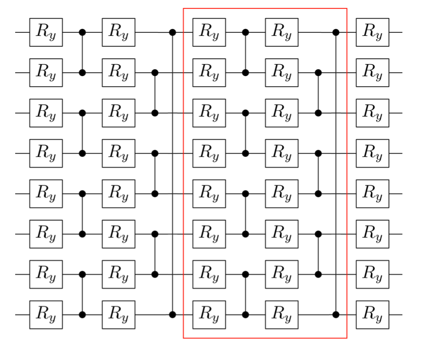
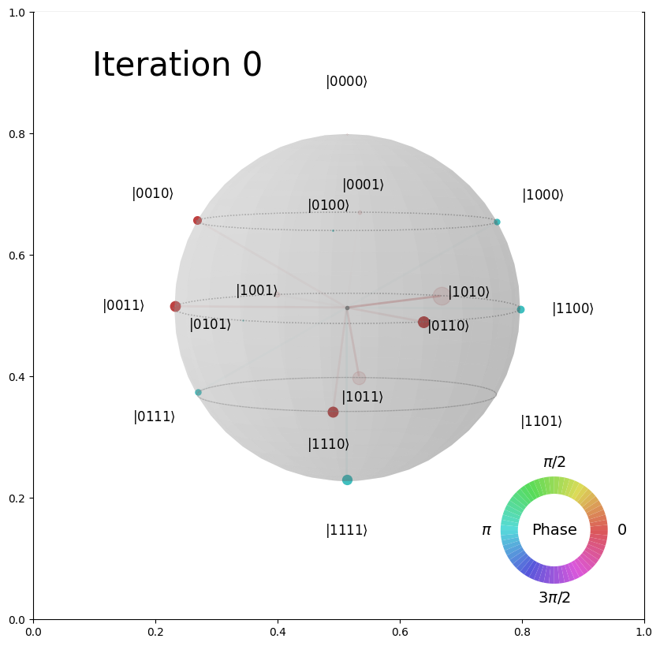

# VQE minimization strategies
Nicole Zattarin [*University of Milan*]

**Introduction**

Quantum computers aim to solve problems with high computational costs, which are impossible for classical computers to approach. Nevertheless noise and decoherence are major problems on near term quantum devices. 
To overcome such issues Variational quantum algorithms are considered. These methods are quantum-classical hybrid optimization schemes that employ a classical minimizer to train a parametrized multiple-layer quantum circuit. 

## The problem 

Our analysis focuses on the role played by optimizers during this procedure. We aim to find the family of minimizers that best suit different QML problems and to verify the role of entanglement. To do so we approach different strategies of minimization: quasi-Newton methods, heuristic techniques, hyperparameter optimization, stochastic approximation and adiabatic evolution. 

Therefore, with the code provided in this directory, we test different algorithms and strategies on the well-known problem of finding the ground state of an hamiltonian with Variational Quantum Eigensolver. Simulations of quantum algorithms on classical devices are performed with [Qibo](https://github.com/qiboteam/qibo), a framework for quantum simulation.

The results reached with this previous analysis are the basis to approach the problem of minimization in a Quantum Binary Classifier. Indeed I'm a collaborator of a project that aims to provide a quantum variational binary classifier (not public atm).

### Target model and variational ansatz

The parameterized quantum circuit used as variational ansatz for VQE, in the case of a 8-qubits simulation follows:



Each layer is represented by the gates within the red box. The whole circuit is only composed by CZ gates between adjacent qubits and rotations RY rotations.

We benchmark a VQE minimization, based on the previous circuit, using [qibo.models.VQE](https://qibo.readthedocs.io/en/stable/qibo.html#qibo.models.VQE.minimize) to find the ground state of the XXZ hamiltonian of the Heisenberg's problem. 
Since it is possible to evaluate the minimum eigenvalue of an hamiltonian in Qibo, we can comprare the results of VQE minimization with the expected value. 
As a measure of accuracy, we introduce the logarithmic scale and define the quantity: log(1/eps), where eps is the gap between the expected result and the 'experimental' one.

Eventually, we repeat the simulations for different number of qubits and different number of layers.
Tests are done on systems with less than 15 qubits, so we perform a single thread execution, because in such cases the parallelization overhead may decrease performance.

## Strategies employed 

- **Scipy's algorithms:** they don't need presentations, they're the optimizers implemented in Scipy, see [scipy.optimize.minimize](https://docs.scipy.org/doc/scipy/reference/generated/scipy.optimize.minimize.html#scipy.optimize.minimize) for details;
- **iMinuit:** a Python interface for the Minuit2 C++ library maintained by CERN’s ROOT team;
- **CMA:** covariance matrix adaptation evolution strategy (CMA-ES) implemented in Python;
- **Genetic algorithms:** my own implementation (see [genetic](https://github.com/nicolezatta/VQE-minimization-strategies/blob/main/optimizers/genetic.py)) with [Deap](https://deap.readthedocs.io/en/master/) of a genetic approach to minimization;
- **Hyperoptimization as pure optimizer:** an implementation of an optimizer that uses a hyperoptimization approach with [Optuna](https://optuna.org);
- **Adiabatically Assisted VQE:** a strategy for parameters training based on repeating VQE's minimization throughout an adiabatic evolution. VQE is first performed on a simple, well known, hamiltonian; then this hamiltonian gradually evolutes to the one of the problem. At each step VQE is performed and the output parameters become the starting parameters of the next minimization;
- **Simultaneous perturbation stochastic approximation:** known as [SPSA](https://www.jhuapl.edu/spsa/), is an optimizer based on gradient approximation that requires only two objective function measurements per iteration;
- **Training a single layer at a time:** a strategy in which I freeze the whole circuit, exception made from just one layer and then VQE starts. VQE's minimization is reapeated for every layer of the circuit and then again from the first layer to the last one, until convergence is reached.


## Repository organization

```
VQE-minimization-strategies
│   AAVQE.py  
│   LICENSE   
│   README.md  
│   ansatz.py    
│   main.py    
│   myvqe.py    
│   parameters_evolution.py    
│   tester.py    
│   traininglyer.py    
│
└───optimizers
│   │	genetic.py
│   │	optimizer.py
│   │	pso.py
│   │	spsa.py
│
└───results
│   │	/images
│   │	RESULTS.md
│   
└───tuners
    │	architecture_genetic_tuner.py
    │	spsa_tuner.py
```
## A taste of results

All the results are discussed in [RESULTS](https://github.com/nicolezatta/VQE-minimization-strategies/blob/main/results/RESULTS.md), but in order to arouse your interest we provide an overview of results.

### Hardware resources 

- **[Unimi's LCM cluster](https://lcm.mi.infn.it/il-laboratorio/la-struttura/)** cluster with a total amount of 920 cores, divided on different CPUs, for a total memory of 1150 GB, every node has a maximum of 48 cores. The scheduling mechanism and the high number of devices involved make this a stable machine;
- **Montblanc private server:**  server with 64 threads and 125GB of memory. Faster than Galileo, but less stable, since execution time is more likely to be affected by simultaneous excecutions;
- **Local:** 2.3 GHz Quad-Core Intel Core i5

### Examples of plots

For instance the plot below provides a simple benchmark of gradient-based algorithms on a 4-qubits circuit:

<embed src="results/images/error_gradientbased_vqe.pdf" type="application/pdf">

Error bars are evaluated repeating the simulations with different seeds to generate initial parameters. Gradient-based algorithms exhibit a weak dependance by seed, the most error-affected methods are BFGS and SPSA, whose bands do not cover more than ±2.


We are also interested in studying the evolution of parameters (thus of states) during minimization, for example the QSphere below shows the evolution of the state toward the ground state for trust-constr algorithm:


<p align="center">
	  
</p>
