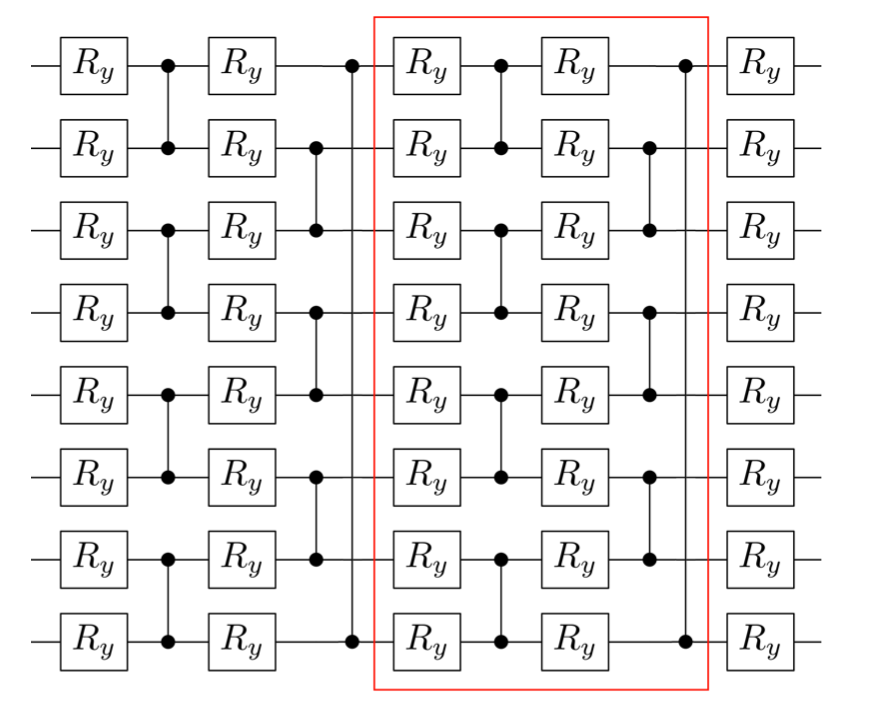
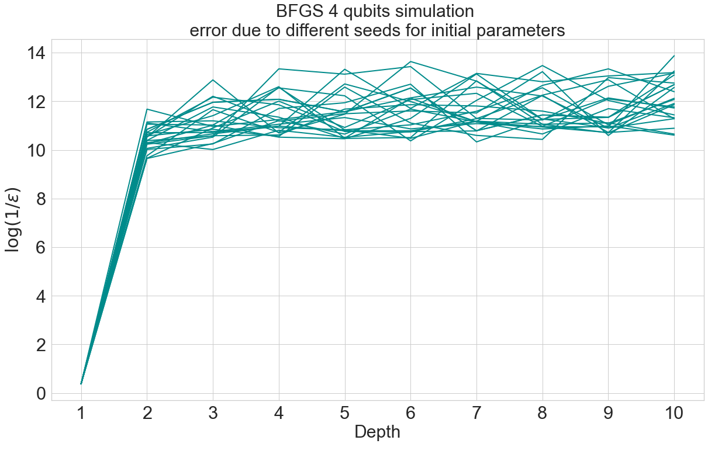
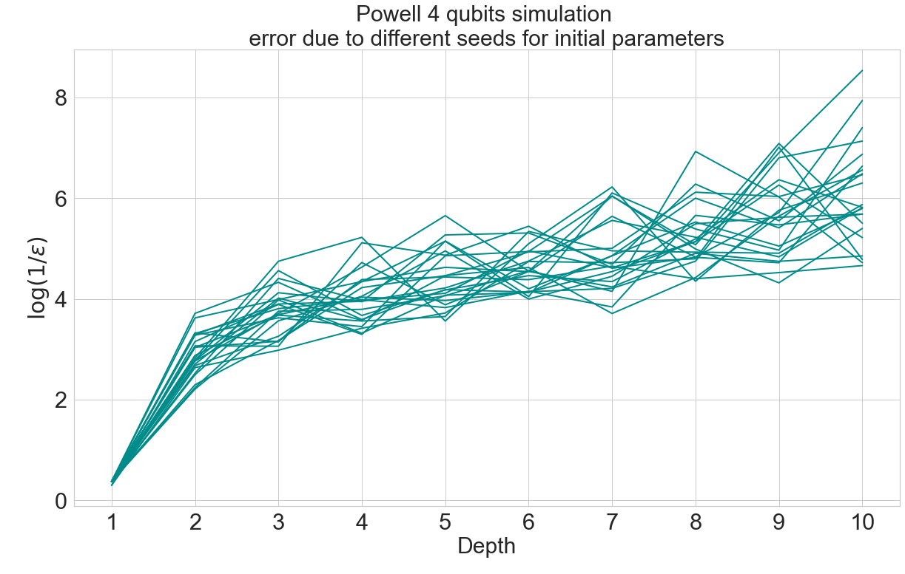
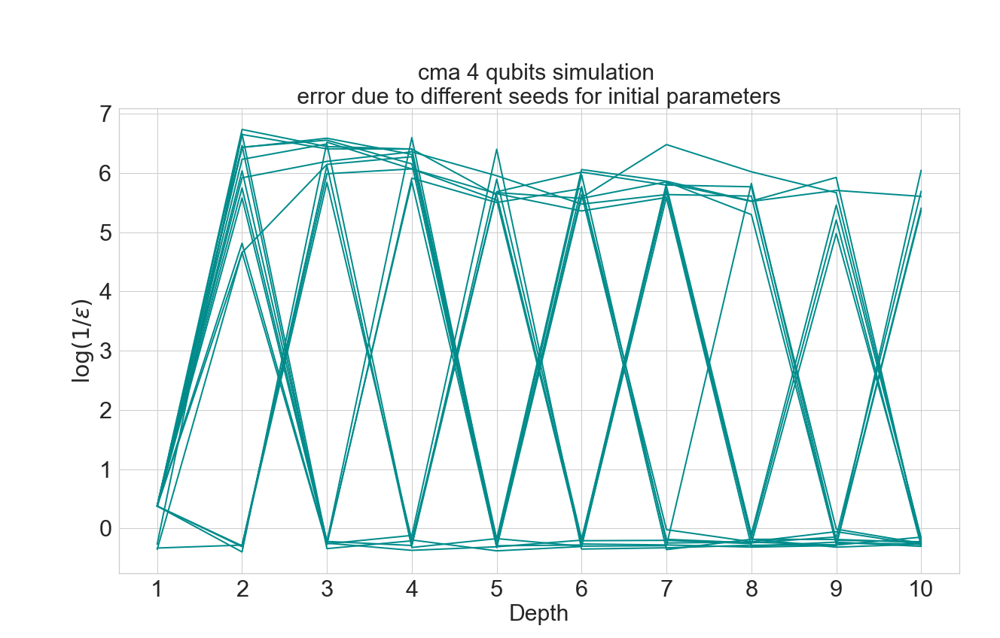

# Benchmarks

## Scipy and iMinuit minimizers 

Consider a variational circuit where every layer is made up by RY rotations followed by a layer of CZ gates in order to entangle the qubits, as shown in this figure: 

We perform a VQE minimization, based on the previous circuit, using [qibo.models.VQE](https://qibo.readthedocs.io/en/stable/qibo.html#qibo.models.VQE.minimize) in order to find the ground state of a Heisenberg XXZ hamiltonian. 
Since it's possible to evaluate the minimum eigenvalue of an hamiltonian in Qibo, we can comprare the results of VQE minimization with the expected value. 

We benchmark different minimization algorithm taken from [scipy.optimize.minimize](https://docs.scipy.org/doc/scipy/reference/generated/scipy.optimize.minimize.html) and migrad from [iminuit.minimize](https://iminuit.readthedocs.io/en/stable/reference.html#iminuit.minimize). Take as measure of the accuracy of VQE with different minimization algorithms: log(1/eps), where eps is the gap |result-expected|.

The configuration is repeated for a different number of layers and the input parameters are chosen randomly from 0 to 2pi in all benchmarks.

  

 

Accuracy is plotted with the same limits on y axis, in order to better compare different circuits with different number of qubits. 
Note: simulation performed on Galileo (1 cpu per task)

## Error due to different seeds
When we find the ground state, the initial parameters of the optimization are stored in a (2 * nQubits * nLayers + nQubits) dimensions array of random values extracted uniformly in (0, 2pi). Repeating the same simulation with different seeds we observe the oscillations shown in these plots:

    
 
    
    
 
It's possible to observe that trust-constr, that is the most accurate algorithm tested for a 4 qubits circuit, is also the less affected by seed change.

(runned on my own machine, previous tests shown that this doesn't affect accuracy)

##CMA and genetic
We teste CMA optimizer implemented in Qibo on a 4 qubits circuit, first without extra options and then with a 10e-4 tolerance, in order to find the proper trade off between time and accuracy.

		Simulation without setting tolerance:             Simulation with 10e-4 tolerance:

 

 

 

We see that even setting a tolerance, that is 10e10 highter that the default one, time doesn't decrease significantly. While accuracy has the same issues in both cases.
Same trends for 6 and 8 qubits simulations setting tolerance:

 

## CMA output results
cma convergence to best:

 

we see that accuracy increases if the algorithm finds it's way to the best earlier, without oscillating around a fixed value as in 4 qubits 4 layers.
note that running the same algorithm different times may produce a bit different output.

