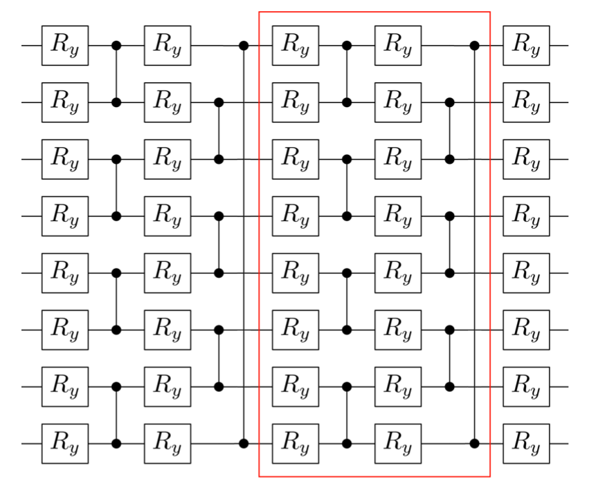
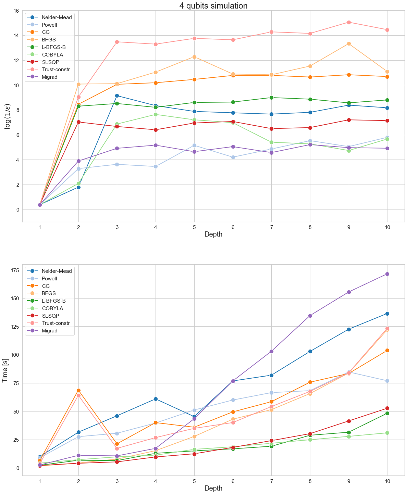
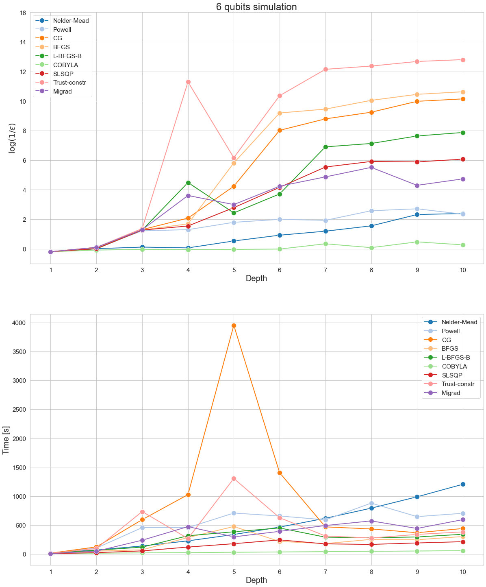
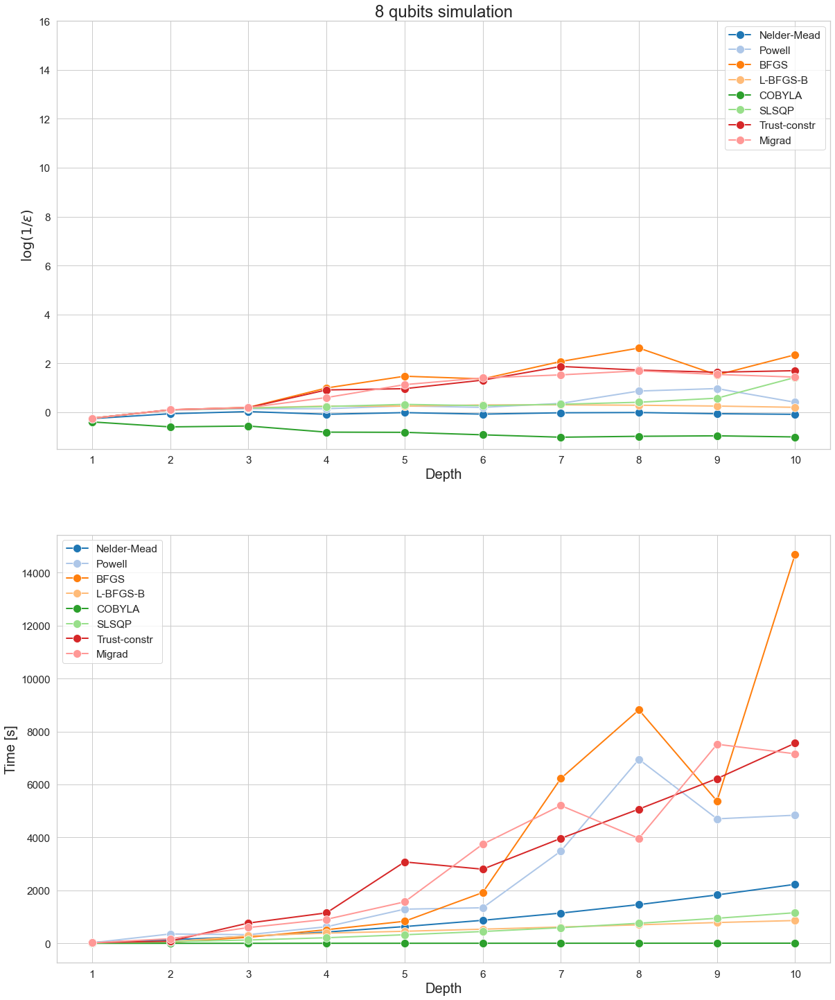
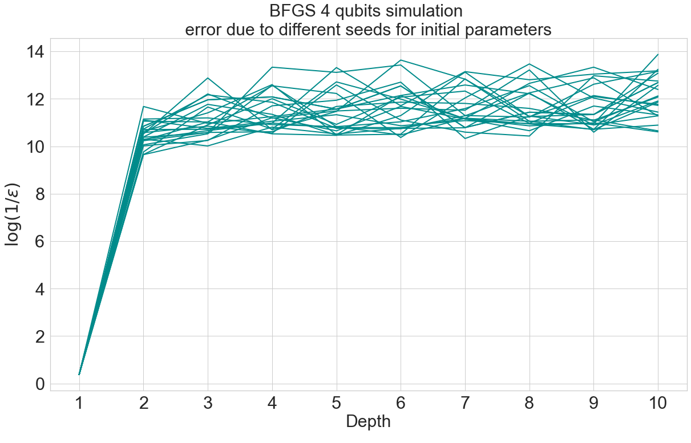
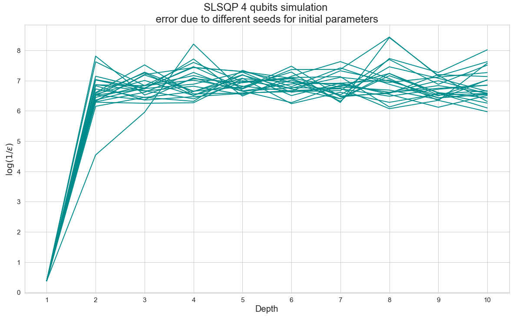
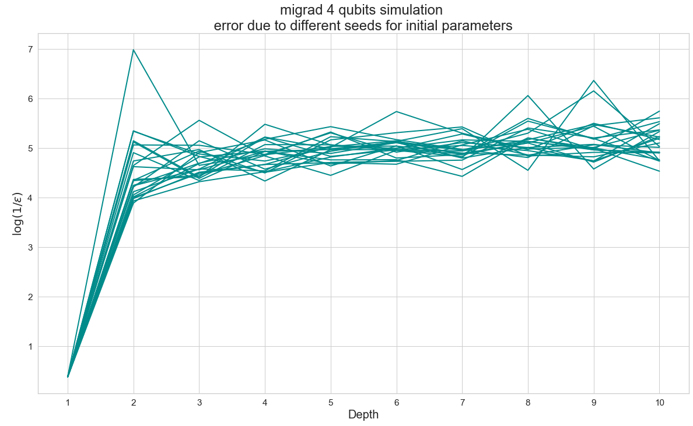

# Benchmarks

## Scipy and iMinuit minimizers 

Consider a variational circuit where every layer is made up by RY rotations followed by a layer of CZ gates in order to entangle the qubits, as shown in this figure: 

We perform a VQE minimization, based on the previous circuit, using [qibo.models.VQE](https://qibo.readthedocs.io/en/stable/qibo.html#qibo.models.VQE.minimize) in order to find the ground state of a Heisenberg XXZ hamiltonian. 
Since it's possible to evaluate the minimum eigenvalue of an hamiltonian in Qibo, we can comprare the results of the VQE minimization with the expected value. 

We benchmarked different minimization algorithm taken from [scipy.optimize.minimize](https://docs.scipy.org/doc/scipy/reference/generated/scipy.optimize.minimize.html) and migrad from [iminuit.minimize](https://iminuit.readthedocs.io/en/stable/reference.html#iminuit.minimize). Take as measure of the accuracy of VQE with different minimization algorithms: log(1/eps), where eps is the gap |result-expected|.

The configuration is repeated for a different number of layers and the input parameters are chosen randomly from 0 to 2pi in all benchmarks.

Simulation with 4 qubits circuit:

 

Simulation with 6 qubits circuit:

Simulation with 8 qubits circuit:

 

Accuracy is plotted with the same limits on y axis in order to better compare different number of qubits circuits. 
Note: simulation performed on Galileo (1 cpu per task)

## Error due to different seeds
When we find the ground state the initial parameters of the optimization are a (2 * nQubits * nLayers + nQubits) dimensions array of random values extracted uniformly in (0, 2pi). Repeating the same simulation with different seeds we observe oscillations, as shown in these plots:

   
 

work in progress:
  - hyperopt nlayers-nqubits
  - hyperopt genetic with best nlayers-nqubits
  - test genetic and cma
  - hyperopt
