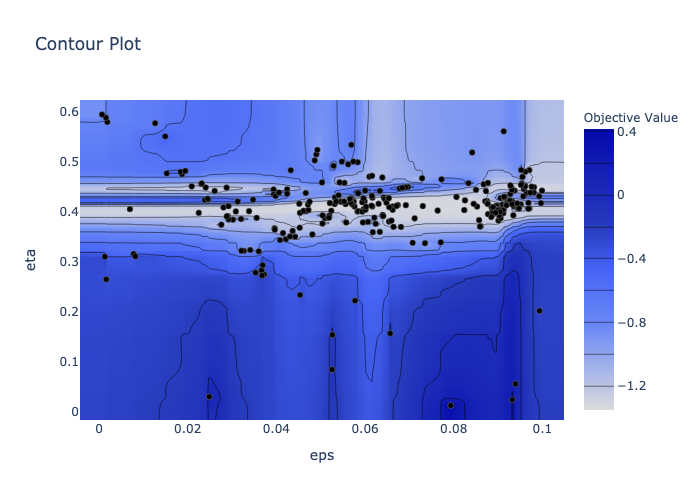

# VQE Benchmarks
We test minimization strategies the Variational Quantum Eigensolver (VQE) problem. Here we present the benchmarks results.

Consider a variational circuit where every layer consists of RY rotations followed by a layer of CZ gates in order to entangle the qubits, as shown in the figure below:

This same circuit has been used as ansatz for a variational quantum algorithm, implemented to benchmark the accuracy of VQE based on a finite-depth variational quantum circuit encoding ground states of local Hamiltonians, namely, the Ising and XXZ models. See [Scaling of variational quantum circuit depth for condensed matter systems](https://quantum-journal.org/papers/q-2020-05-28-272/).

We perform a VQE minimization, based on the previous circuit, using [qibo.models.VQE](https://qibo.readthedocs.io/en/stable/qibo.html#qibo.models.VQE.minimize) to find the ground state of a Heisenberg XXZ hamiltonian. 
Since it's possible to evaluate the minimum eigenvalue of an hamiltonian in Qibo, we can compare the results of VQE minimization with the expected value.  So we measure accuracy as: log(1/eps), and eps is the gap between the results achieved through minimization and the real ground state eigenvalue.

The configuration is repeated for a different number of layers and the input parameters are chosen randomly from 0 to 2pi in all benchmarks.

### Summary:
- VQE benchmarks
	- Gradient-based methods
	- Gradient-free methods
	- Genetic approach
	- Hyperparameters optimization
- Variations to VQE
	- Adiabatically Assisted Variational Quantum Eigensolver (AAVQE)
	- Training layer by layer

## VQE benchmarks

### Gradient-based methods
To benchmark gradient-based algorithms on the model proposed we refer both to [scipy.optimize.minimize](https://docs.scipy.org/doc/scipy/reference/generated/scipy.optimize.minimize.html), and to iMinuit library, [iminuit.minimize](https://iminuit.readthedocs.io/en/stable/reference.html#iminuit.minimize). The SPSA tested is implemented by us instead. To be more precise BFGS, L-BFGS, SLSQP, Trust-constr, and TNC are supported by Scipy, while migrad is offered in the Python interface for the Minuit2 C++ library, maintained by CERN’s ROOT team.

#### Quasi-Newton

An important class of gradient-based algorithms is made up by the so-called quasi-Newton methods, inspired by Newton’s method. 

Here follows a list of quasi-Newton methods tested:

- BFGS: uses the first derivatives only. It is known that this algorithm behaves well also with non-smooth optimizations;
- L-BFGS-B: an extension of the classical BFGS developed to preserve memory. It is specifically a bound constrained minimizer based on: [Algorithm 778: L-BFGS-B: Fortran subroutines for large-scale bound-constrained optimization](https://dl.acm.org/doi/10.1145/279232.279236), and [A Limited Memory Algorithm for Bound Constrained Optimization](https://epubs.siam.org/doi/abs/10.1137/0916069?journalCode=sjoce3&mobileUi=0);
- TNC: a gradient-based truncated Newton algorithm to minimize a function with variables subject to bounds;
- SLSQP: Sequential Least SQuares Programming to minimize a function of several variables with any combination of bounds, equality and inequality constraints;
- trust-constr: a trust-region algorithm for constrained optimization. It is presented in Scipy as the most versatile constrained minimization algorithm implemented in the module and the most appropriate for large-scale problems. 

#### SPSA

Another gradient-based approach to minimization is the Simultaneous perturbation algorithm for stochastic approximation (SPSA) algorithm. We implemented the first order SPSA as explained in [1704.05018v2](https://arxiv.org/pdf/1704.05018v2.pdf#section*.11). 

A learning rate calibration is introduced, as it is discussed in [qiskit.aqua.components.optimizers.SPSA](https://qiskit.org/documentation/_modules/qiskit/aqua/components/optimizers/spsa.html#SPSA). Before testing the algorithm, tuning of the step eps and the learning rate eta is performed, tuner available [here](https://github.com/nicolezatta/VQE-minimization-strategies/blob/main/tuners/spsatuner.py). 

Here we report the contour plots of tuning, respectively for a 4-qubits, 4-layers circuit and a 4-qubits, 6-layers circuit:

#### Migrad

Eventually we test Migrad, from iMinuit library. It is an algorithm of almost exclusive usage in high-energy physics, indeed it is included in Cern’s ROOT library. 

It makes use of first derivatives, while it compute approximated second derivatives, in order to achieve quadratic convergence near the optimum. Thus its main weakness is that it depends on knowledge of the first derivatives, and fails if they are computed inaccurately. As a consequence, it is extremely fast near a minimum, while it is slower if the function is badly behaved.

#### Results

Plots below show accuracy and execution time for different number of layers, for all the gradient-based algorithms taken into account. We clearly see that accuracy decreases with the number of qubits, while time generally increases both with the number of qubits and depth. Simulations are performed on Galileo, which is the more stable hardware resource available, single thread execution with one CPU per task is performed.

	  

	  

	  

Comparing the plots provided we clearly see that as the number of qubits increases, accuracy decreases, while the required execution time becomes higher. 

For a 4-qubits system, layers added after the fourth seem not to be effective: we would expect accuracy to increase indefinitely, but it presents a sort of plateau. This observation is a sign that the circuit is not flexible enough, thus even increasing the number of parameters and entangling gates, minimizers cannot converge more precisely to the optimum. A similar behaviour is observed for a 6- and 8-qubits ansatzes.

### Gradient-free methods
Let us now focus on gradient-free algorithms, in this case we employ methods in [scipy.optimize.minimize](https://docs.scipy.org/doc/scipy/reference/generated/scipy.optimize.minimize.html), that implements the following methods:
- COBYLA: it performs the Constrained Optimization By Linear Approximation (COBYLA) method. The algorithm is based on linear approximations to the objective function and each constraint;
- Nelder-Mead: heuristic search algorithm for multidimensional unconstrained optimization, based on the [Simplex algorithm ](https://academic.oup.com/comjnl/article-abstract/7/4/308/354237));
- Powell: the one implemented in Scipy is a variation to the classical Powell method, for which function need not be differentiable, and no derivatives are taken. If bounds are not provided, as in this case, then an unbounded line search will be used. It performs sequential one-dimensional minimizations along each direction, which is updated at each iteration of the main minimization loop. 

#### Results
Plots below exhibit accuracy and execution time for different number of layers, for all the gradient-free algorithms taken into account.

	  

	  

We conclude that derivative-free algorithms show less performances, in terms of accyracy, than the derivatives-based. This result suggests that the loss function is regular enough to be optimizerd by gradient-based methods, so we do not take advantage by gradient-free methods versatility.

### Genetic approach
Let us now focus on the evolutionary approach to minimization, we exploit two strategies: our implementation of a GA, see code [here](https://github.com/nicolezatta/VQE-minimization-strategies/blob/main/optimizers/genetic.py), and Covariance matrix adaptation evolution strategy (CMA-ES), both with and without BIPOP option.

#### Results
Here time and accuracy for a 4-qubits system:

	  

A first observation concerns accuracy’s irregularity for CMA-ES. Moreover the genetic algorithm implemented with Deap does not get satisfying results in any case, since accuracy is always negative. A remark on execution time must be done: genetic algorithms need more time to run than other methods already discussed. Thus, they need many computational resources and, in this case, such loss is not balanced by high performances in terms of convergence.

To better understand CMA-ES behaviour, let us focus on its way to approach the optimum and reach convergence, the following plots provide such informations:

	  

